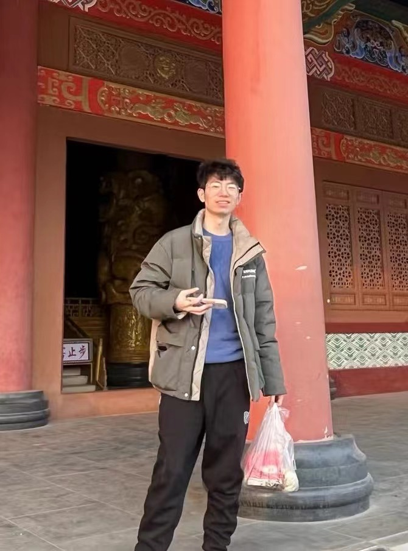

# About Me

Here is **Chongshan Wan (Lance, 万重山)**.

I am a final-year graduate student majoring in Cartography and Geographic Information Systems at the School of Remote Sensing and Information Engineering, Wuhan University. I'm advised by [Prof. Peng Yue](http://jszy.whu.edu.cn/pyue). 

If you are interested in any aspect of me, I would love to chat and collaborate, please email me at - *chongshanwan[at]whu[dot]edu[dot]cn*

## Academic Background

- **Sept. 2022 – Jun. 2024(Expected):** Wuhan University (Master of Cartography and Geography Information System, supervised by [Prof. Peng Yue](http://jszy.whu.edu.cn/pyue))
- **Sept. 2018 – Jun. 2022:** Wuhan University (Bachelor of Remote Sensing Science and Technology)

---

## Research Interests

- Trajectory mining
- Machine learning
- Graph deep learning

---

## PUBLICATION

[1] **Wan, C**., Yue, P., Yang, C., Cai, C., & Liu, X. (2024). Lane Extraction from Trajectories at Road Intersections Based on Graph Transformer Network. International Journal of Geographical Information Science. (Under Minor Revision)

[2] Yuan, M., Yue, P., Yang, C., Li, J., Yan, K., Cai, C., & **Wan, C**. (2024). Generating lane-level road networks from high-precision trajectory data with lane-changing behavior analysis. International Journal of Geographical Information Science, 38(2), 243-273.

[3] Cai, C., Li, J., Huang, J., He, W., **Wan, C**., & Guo, Y. (2024). MapEval: Comprehensive Benchmark Suite for BEV-based Local Online Map Construction Model. 2024 IEEE International Conference on Robotics and Automation (ICRA). (Under review)

---

## PATENTS      

[1] Yue, P.(Advisor), Wan, C., Yang, C., & Cai, C. (2024), “A Method, System, Device, and Medium for Intersection Lane-level Topology Detection Based on Trajectory Data”, Invention patent. (Under Initial Examination)

[2] Yue, P.(Advisor), Wan, C., Yuan, M., & Cai, C. (2024), “A Method, System, Device, and Medium for Intersection Detection and Precise Range Determination Based on Trajectory Data”, Invention patent. (Under Initial Examination)

[3] Yue, P.(Advisor), Cai, C., & Wan, C. (2024), “Method, Device, Equipment, and Medium for Incremental Generation of Road Networks Based on Trajectory Data”, Invention patent. (Under Initial Examination)

---

## RESEARCH PROJECTS                                    
**Road Topology Information Extraction from Crowdsourced Trajectory Data**

(University-Industry Collaboration Project)  

Dec. 2021 - Dec.2023

Researcher | Advisor: Professor Peng Yue   

-	In collaboration with Changan Automobile Company, this project focuses on extracting road topology information from crowdsourced trajectory data.
-	Responsible for road intersection detection, intersection range determination, and intersection topological information extraction based on trajectory data.
-	Proposed an algorithm for precise intersection range determination based on trajectory data and an intersection lane extraction algorithm based on Graph Transformer Networks (GTN). Authored one paper and two patents.

**Transportation mode recognition from cellular signaling data**

(University-Industry Collaboration Project) 

Jun. 2022 - Dec.2022

Researcher | Advisor: Professor Peng Yue 

-	In collaboration with Huawei Technologies Co., Ltd., this project focuses on transportation mode recognition from cellular signaling data.
-	Responsible for transportation mode recognition based on cellular signaling data with low spatial accuracy and low sampling rate.
-	Designed supervised transportation mode recognition algorithms based on Random Forest and unsupervised transportation mode recognition algorithms based on Gaussian Mixture Models (GMM).

